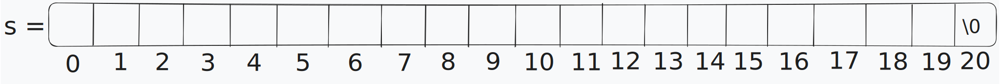
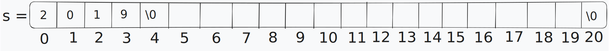
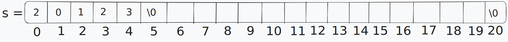

# Rezolvare Bac Info 2023 - varianta 7

## Subiectul I

### Exercitiul 1:

**Raspuns Corect: b**

**Explicatie:**

Trebuie gasite valorile lui `x` si `y` astfel incat expresia `y%x–(x/y)*3!=0` sa aibe valoarea **1**

Pentru varianta `a`, inlocuitm `x` cu 25 si `y` cu 75 si obtinem:
`75 % 25 - (25 / 75) * 3 != 0` ➔ `0 - (0) * 3 != 0` ➔ `0 - 0 != 0`
➔ `0 != 0` care este fals, deci valoare expresiei este **0**, nu **1**

Pentru varianta `b`, inlocuitm `x` cu 25 si `y` cu 15 si obtinem:
`15 % 25 - (25 / 15) * 3 != 0` ➔ `15 - (1) * 3 != 0` ➔ `15 - 3 != 0`
➔ `12 != 0` care este adevarat, deci valoare expresiei este **1**

Pentru varianta `c`, inlocuitm `x` cu 15 si `y` cu 0 si obtinem:
`0 % 15 - (15 / 0) * 3 != 0` ➔ Eroare la impartirea la **0**

Pentru varianta `d`, inlocuitm `x` cu 10 si `y` cu 30 si obtinem:
`30 % 10 - (10 / 30) * 3 != 0` ➔ `0 - (0) * 3 != 0` ➔ `0 - 0 != 0`
➔ `0 != 0` care este fals, deci valoare expresiei este **0**, nu **1**

### Exercitiul 2:

**Raspuns Corect: c**

**Explicatie:**

Avem functia `f` definita astfel (codul este neschimbat din punct de vedere al functinalitatii,
dar a fost putin reformatat pentru a fi mai usor de inteles):

```cpp
int f(int x, int y) { 
    int z;

    if (y == 0) 
        return 1;

    z = f(x, y/2);

    if (y % 2 != 0) 
        return z * z * x;

    return z * z;
}
```

Pentru apelul `f(x=3, y=2)`, variabila z = `f(x=3, y=(2/2))` ➔ `f(x=3, y=1)`
Pentru ca y este par, returnam z * z, a carui valoare nu o stim inca

Pentru apelul `f(x=3, y=1)` variabila z = `f(x=3, y=(1/2))` ➔ `f(x=3, y=0)`
Pentru ca y este impar, returnam z * z * x, adica z * z * 3 (nu stim valoarea acestui z)

Pentru apelul `f(x=3, y=0)` se returneaza direct 1 pentru ca y este 0

Am aflat valoarea lui z pentru `f(x=3, y=1)`, deci se returneaza 1 * 1 * 3, adica 3
Am aflat valoarea lui z pentru `f(x=3, y=2)`, deci se returneaza 3 * 3, adica 9

Rezultatul final este **9**

### Exercitiul 3:

**Raspuns Corect: a**

**Explicatie:**

La inceput ne putem imagina variabila s ca la un loc in memorie cu 20 de locuri goale:



Dupa ce executam primia linie de cod:

```cpp
strcpy(s,"2019");
```

Care copiaza in memorie incepand de la s+0, textul `2019`, starea variabile `s` va fi:



Dupa ce executam a doua linie de cod:

```cpp
strcpy(s+3,"23");
```

Care copiaza in memorie incepand de la s+3, textul `23`, starea variabilei `s` va fi:


Deci, valoarea finala a sirului de caractere `s` este **20123**

### Exercitiul 4:

**Raspuns Corect: b**

**Explicatie:**

Multimea initiala este: {**bergamotă**, **cireș**, **iris**, **lămâie**, **salcâm**}, dar
pentru simplitate putem nota fiecare esenta cu un numar astfel:

- bergamotă = 1
- cireș = 2
- iris = 3
- lămâie = 4
- salcâm = 5

Primele 4 amestecuri generate sunt:

1. (bergamotă, cireș, iris)
2. (bergamotă, cireș, lămâie)
3. (bergamotă, cireș, salcâm)
4. (bergamotă, iris, lămâie)

Care ar arata asa daca inlocuim fiecare esenta cu numarul corespunzator si sa generam toate
amestecurile valide am obtine:

1. (1, 2, 3)
2. (1, 2, 4)
3. (1, 2, 5)
4. (1, 3, 4)
5. (1, 3, 5)
6. (1, 4, 5)
7. (2, 3, 4)
8. (2, 3, 5)
9. (2, 4, 5)
10. (3, 4, 5)

Penultimul amestec generat a fost (2, 4, 5), care inseamna defapt (**cireș**, **lămâie**, **salcâm**)

### Exercitiul 5:

**Raspuns Corect: b**

**Explicatie:**


## Subiectul II

## Subiectul III
